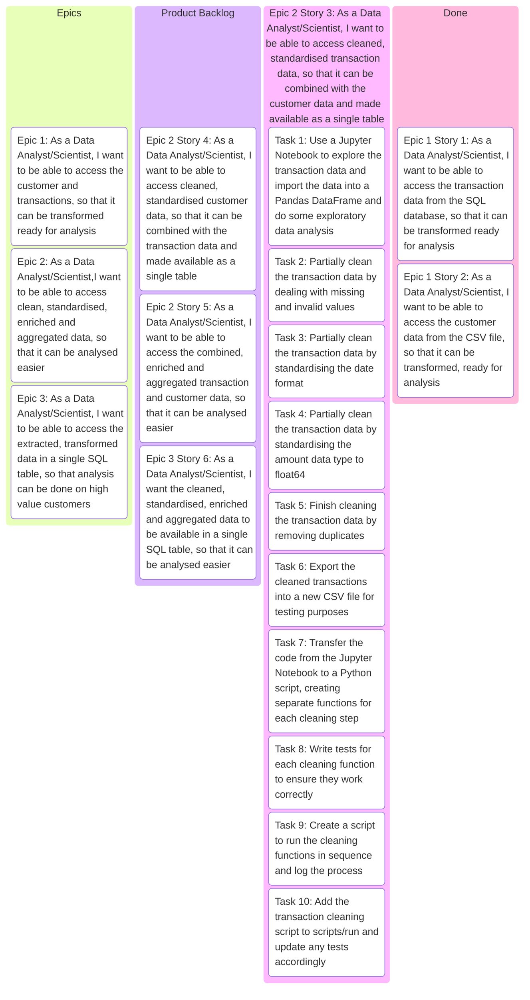
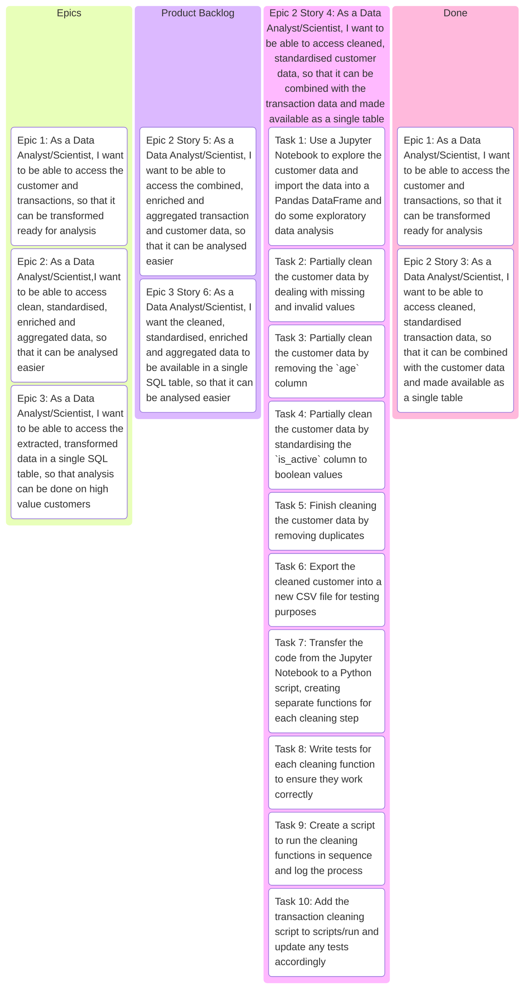
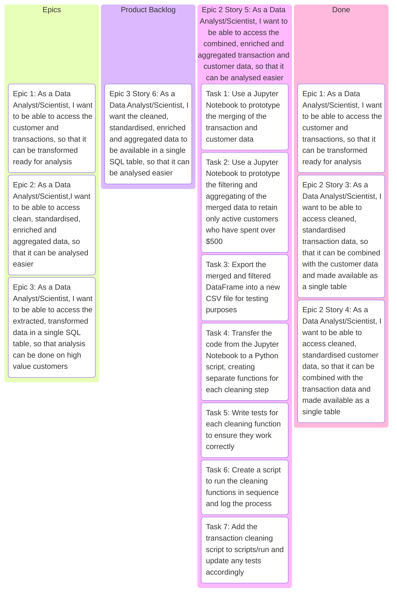

# Project Kanban

## For Epic 2 Story 3

```mermaid
kanban
    Epics
        (Epic 1: As a Data Analyst/Scientist, I want to be able to access the customer and transactions, so that it can be transformed ready for analysis)
        (Epic 2: As a Data Analyst/Scientist,I want to be able to access clean, standardised, enriched and aggregated data, so that it can be analysed easier)
        (Epic 3: As a Data Analyst/Scientist, I want to be able to access the extracted, transformed data in a single SQL table, so that analysis can be done on high value customers)
    Product Backlog
        (Epic 2 Story 4: As a Data Analyst/Scientist, I want to be able to access cleaned, standardised customer data, so that it can be combined with the transaction data and made available as a single table)
        (Epic 2 Story 5: As a Data Analyst/Scientist, I want to be able to access the combined, enriched and aggregated transaction and customer data, so that it can be analysed easier)
        (Epic 3 Story 6: As a Data Analyst/Scientist, I want the cleaned, standardised, enriched and aggregated data to be available in a single SQL table, so that it can be analysed easier)
    Todo (Epic 2 Story 3: As a Data Analyst/Scientist, I want to be able to access cleaned, standardised transaction data, so that it can be combined with the customer data and made available as a single table)
        Task 1: Use a Jupyter Notebook to explore the transaction data and import the data into a Pandas DataFrame and do some exploratory data analysis
        Task 2: Partially clean the transaction data by dealing with missing and invalid values
        Task 3: Partially clean the transaction data by standardising the date format
        Task 4: Partially clean the transaction data by standardising the amount data type to float64
        Task 5: Finish cleaning the transaction data by removing duplicates
        Task 6: Export the cleaned transactions into a new CSV file for testing purposes
        Task 7: Transfer the code from the Jupyter Notebook to a Python script, creating separate functions for each cleaning step
        Task 8: Write tests for each cleaning function to ensure they work correctly
        Task 9: Create a script to run the cleaning functions in sequence and log the process
        Task 10: Add the transaction cleaning script to scripts/run and update any tests accordingly
    Done
        (Epic 1 Story 1: As a Data Analyst/Scientist, I want to be able to access the transaction data from the SQL database, so that it can be transformed ready for analysis)
        (Epic 1 Story 2: As a Data Analyst/Scientist, I want to be able to access the customer data from the CSV file, so that it can be transformed, ready for analysis)
```

---
---

## For Epic 2 Story 4

```mermaid
kanban
    Epics
        (Epic 1: As a Data Analyst/Scientist, I want to be able to access the customer and transactions, so that it can be transformed ready for analysis)
        (Epic 2: As a Data Analyst/Scientist,I want to be able to access clean, standardised, enriched and aggregated data, so that it can be analysed easier)
        (Epic 3: As a Data Analyst/Scientist, I want to be able to access the extracted, transformed data in a single SQL table, so that analysis can be done on high value customers)
    Product Backlog
        (Epic 2 Story 5: As a Data Analyst/Scientist, I want to be able to access the combined, enriched and aggregated transaction and customer data, so that it can be analysed easier)
        (Epic 3 Story 6: As a Data Analyst/Scientist, I want the cleaned, standardised, enriched and aggregated data to be available in a single SQL table, so that it can be analysed easier)
    Todo (Epic 2 Story 4: As a Data Analyst/Scientist, I want to be able to access cleaned, standardised customer data, so that it can be combined with the transaction data and made available as a single table)
        Task 1: Use a Jupyter Notebook to explore the customer data and import the data into a Pandas DataFrame and do some exploratory data analysis
        Task 2: Partially clean the customer data by dealing with missing and invalid values
        Task 3: Partially clean the customer data by removing the `age` column
        Task 4: Partially clean the customer data by standardising the `is_active` column to boolean values
        Task 5: Finish cleaning the customer data by removing duplicates
        Task 6: Export the cleaned customer into a new CSV file for testing purposes
        Task 7: Transfer the code from the Jupyter Notebook to a Python script, creating separate functions for each cleaning step
        Task 8: Write tests for each cleaning function to ensure they work correctly
        Task 9: Create a script to run the cleaning functions in sequence and log the process
        Task 10: Add the transaction cleaning script to scripts/run and update any tests accordingly
    Done
        (Epic 1: As a Data Analyst/Scientist, I want to be able to access the customer and transactions, so that it can be transformed ready for analysis)
        (Epic 2 Story 3: As a Data Analyst/Scientist, I want to be able to access cleaned, standardised transaction data, so that it can be combined with the customer data and made available as a single table)
```

---
---

### For Epic 2 Story 5

```mermaid
kanban
    Epics
        (Epic 1: As a Data Analyst/Scientist, I want to be able to access the customer and transactions, so that it can be transformed ready for analysis)
        (Epic 2: As a Data Analyst/Scientist,I want to be able to access clean, standardised, enriched and aggregated data, so that it can be analysed easier)
        (Epic 3: As a Data Analyst/Scientist, I want to be able to access the extracted, transformed data in a single SQL table, so that analysis can be done on high value customers)
    Product Backlog
        (Epic 3 Story 6: As a Data Analyst/Scientist, I want the cleaned, standardised, enriched and aggregated data to be available in a single SQL table, so that it can be analysed easier)
    (Epic 2 Story 5: As a Data Analyst/Scientist, I want to be able to access the combined, enriched and aggregated transaction and customer data, so that it can be analysed easier)
        Task 1: Use a Jupyter Notebook to prototype the merging of the transaction and customer data
        Task 2: Use a Jupyter Notebook to prototype the filtering and aggregating of the merged data to retain only active customers who have spent over $500
        Task 3: Export the merged and filtered DataFrame into a new CSV file for testing purposes
        Task 4: Transfer the code from the Jupyter Notebook to a Python script, creating separate functions for each cleaning step
        Task 5: Write tests for each cleaning function to ensure they work correctly
        Task 6: Create a script to run the cleaning functions in sequence and log the process
        Task 7: Add the transaction cleaning script to scripts/run and update any tests accordingly
    Done
        (Epic 1: As a Data Analyst/Scientist, I want to be able to access the customer and transactions, so that it can be transformed ready for analysis)
        (Epic 2 Story 3: As a Data Analyst/Scientist, I want to be able to access cleaned, standardised transaction data, so that it can be combined with the customer data and made available as a single table)
        (Epic 2 Story 4: As a Data Analyst/Scientist, I want to be able to access cleaned, standardised customer data, so that it can be combined with the transaction data and made available as a single table)
```
